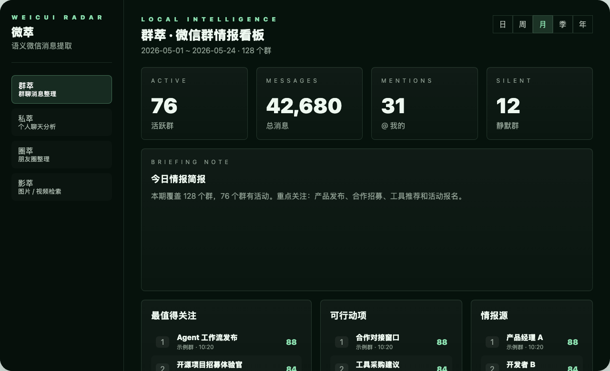
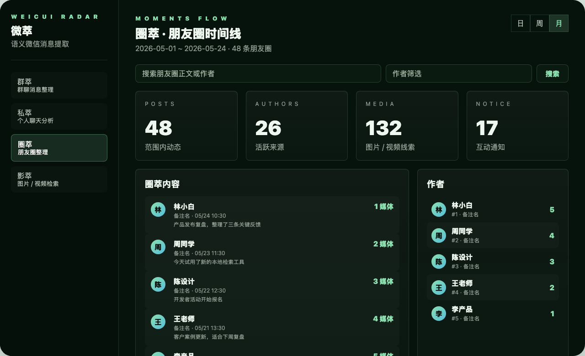
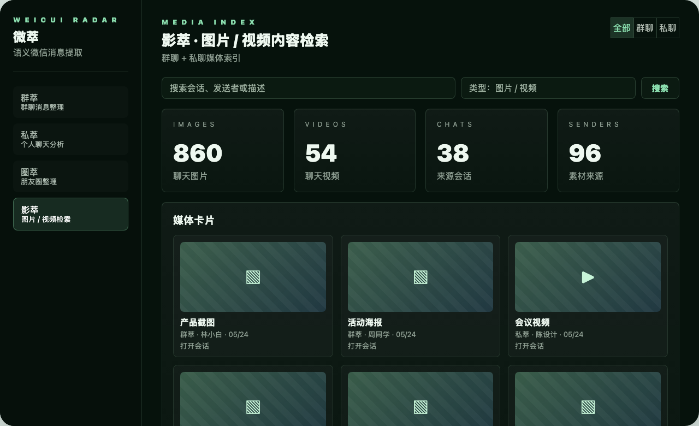

# 微萃

微萃是一个本机运行的微信语义消息提取看板，面向个人本地数据整理。它通过本机已安装的 `wx` 命令读取微信本地缓存数据，使用 SQLite 存储和本地规则分析，不接入外部 LLM，也不上传聊天数据。

## 截图

以下截图为脱敏示意图，不包含真实微信联系人或聊天内容。







## 功能模块

- 群萃：微信群聊消息整理，包含看板、信号流、话题雷达、链接情报、群列表和群详情。
- 私萃：近期个人聊天分析，包含私聊列表、消息、文件、链接、图片和视频聚合。
- 圈萃：朋友圈内容整理，支持时间线、作者筛选、关键词搜索和互动统计。
- 影萃：图片 / 视频内容检索，覆盖群聊和私聊媒体，支持预览图片、播放视频和跳回会话。

## 技术栈

- 前端：TypeScript + React + Vite
- 后端：Node.js + Express
- 数据库：本地 SQLite
- 数据源：本机 `wx` 命令，也就是 `@jackwener/wx-cli`

## 本机使用

先确认本机已经登录微信，并且 `wx` 命令已经初始化可用。

```bash
npm ci
npm run dev
```

启动后打开：

```text
http://127.0.0.1:5173/
```

常用命令：

```bash
npm run dev          # 同时启动后端和 Vite 前端
npm run dev:server   # 只启动本地 API
npm run dev:web      # 只启动前端
npm run typecheck    # TypeScript 类型检查
npm run build        # 生产构建验证
```

## 初始化与同步

页面会自动检测本机消息服务状态。如果提示不可用，先确认：

1. 桌面微信已经启动并登录。
2. `wx daemon status` 正常。
3. `wx sessions --json -n 1` 可以返回本地会话数据。

如果 `wx` 首次使用或微信更新导致密钥失效，需要按 `wx-cli` 的说明重新初始化。初始化完成后回到页面点击“全量同步”或“重扫”。

同步范围按当前模块执行：

- 群萃：同步微信群消息、群成员和群详情。
- 私萃：同步近期一对一聊天。
- 圈萃：同步本机缓存的朋友圈和互动通知。
- 影萃：刷新聊天图片和视频索引。

## 数据与隐私

真实微信数据只保存在本机 `data/` 目录中。该目录已经加入 `.gitignore`，不会提交到仓库。

不会提交的内容包括：

- `data/`
- SQLite 数据库
- 媒体缓存
- 日志文件
- `.env`
- `node_modules/`
- `dist/`

共享项目时，只共享源码和 README。接收方需要在自己的电脑上安装依赖、登录微信并初始化 `wx-cli`，然后重新同步自己的本地数据。

## 共享给他人

```bash
git clone git@github.com:Payhon/weicui.git
cd weicui
npm ci
npm run dev
```

对方需要自行准备：

- macOS 本机微信登录状态
- 可用的 `wx` 命令
- 本机 `~/.wx-cli/config.json`
- 本地微信缓存数据

## 联系方式

微信：`payhon`
